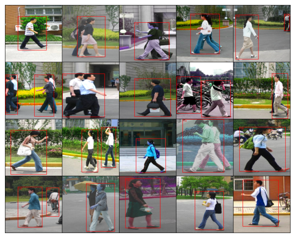

# Single Shot Multibox Detection (SSD) with ResNet-34 Backbone

A PyTorch implementation of **Single Shot Multibox Detection (SSD)** trained on the **Penn-Fudan Pedestrian** dataset.  
This project focuses on building the SSD pipeline end-to-end: dataset + augmentations, anchor generation, IoU matching, box encoding/decoding, hard negative mining, and NMS inference.

Penn-Fudan is small (96 training images) and the pedestrians are often small and skinny, which made RandomIoUCrop behave badly. With parameters like min_scale=0.6 and sampler_options=(0.5, 0.7, 0.9), valid crops were often impossible because many pedestrians occupy only ~10% of the frame. This led to infinite crop search loops, and after loosening constraints, many crops became low quality (background-only, missing GT, or centered people with dropped boxes). To solve this, I replaced IoU-based cropping with a custom GT-centered cropping transform that samples object-centric crops around a randomly chosen GT box, enforces visibility constraints, and includes bounded retries. I also added a safety net in __getitem__ to prevent training samples from ending up with zero GT boxes after augmentation.

- **Dataset**: Penn-Fudan Pedestrian (mask-based boxes via masks_to_boxes)
- **Input size**: 300×300 RGB
- **Classes**: 2 (background + pedestrian)
- **Total anchors**: 7760 per image

## Augmentations

### Photometric + Geometric Pipeline

Training pipeline (torchvision v2):

- ToImage()
- RandomPhotometricDistort()
- RandomChoice()
  - SafeBoxCenteredCrop() (50%)
  - RandomResizedCrop() (30%)
  - Identity() (20%)
- RandomHorizontalFlip(p=0.5)
- Resize((300, 300))
- SanitizeBoundingBoxes(min_size=1)
- ToDtype(torch.float32, scale=True)

### SafeBoxCenteredCrop

A bounded-retry, object-centric crop that:

- picks a target GT box (biased toward larger boxes)
- samples crop size via a **context multiplier** (crop_w/h = s × box_w/h)
- enforces:
  - crop area within a fraction of image area
  - crop aspect ratio bounds
  - target visibility threshold
  - keep threshold for non-target boxes
- falls back cleanly if no crop is valid

If augmentation drops all boxes, __getitem__ falls back to:
1) pipeline without crop  
2) if still empty, preserve the largest original box

## Backbone

This SSD uses a ResNet-34 ImageNet-pretrained backbone, modified to output multi-scale feature maps for SSD heads.

### Original ResNet-34

| Stage    | Operation                        | Output Shape (C × H × W) |
| -------- | -------------------------------- | ------------------------ |
| Input    | -                                | 3 × 300 × 300            |
| Conv1    | 7×7, stride 2, pad 3             | 64 × 150 × 150           |
| MaxPool  | 3×3, stride 2, pad 1             | 64 × 75 × 75             |
| Layer 1  | 3 blocks, stride 1               | 64 × 75 × 75             |
| Layer 2  | 4 blocks, stride 2 (first block) | 128 × 38 × 38            |
| Layer 3  | 6 blocks, stride 2 (first block) | 256 × 19 × 19            |
| Layer 4  | 3 blocks, stride 2 (first block) | 512 × 10 × 10            |
| AvgPool  | global (kernel = 10×10)          | 512 × 1 × 1              |
| FC       | 1000 (ImageNet)                  | -                        |

### Adjusted SSD Backbone Outputs

Anchors are applied starting at Layer2 and onward.

| Stage    | Operation                        | Output Shape (C × H × W) | Anchors |
| -------- | -------------------------------- | ------------------------ | ------- |
| Input    | -                                | 3 × 300 × 300            | No      |
| Conv1    | 7×7, stride 2, pad 3             | 64 × 150 × 150           | No      |
| MaxPool  | 3×3, stride 2, pad 1             | 64 × 75 × 75             | No      |
| Layer 1  | 3 blocks, stride 1               | 64 × 75 × 75             | No      |
| Layer 2  | 4 blocks, stride 2 (first block) | 128 × 38 × 38            | Yes     |
| Layer 3  | 6 blocks, stride 2 (first block) | 256 × 19 × 19            | Yes     |
| Layer 4  | 3 blocks, stride 2 (first block) | 512 × 10 × 10            | Yes     |
| C5       | Conv2d(512, 256, ks=3, s=2, p=1) | 256 × 5 × 5              | Yes     |
| C6       | Conv2d(256, 256, ks=3, s=2, p=1) | 256 × 3 × 3              | Yes     |
| C7       | Conv2d(256, 256, ks=3, s=2, p=1) | 256 × 1 × 1              | Yes     |

All maps are projected to 256 channels before prediction heads.

## Feature Maps

Feature maps produced by the backbone:

- f3: (1, 256, 38, 38)  
- f4: (1, 256, 19, 19)  
- f5: (1, 256, 10, 10)  
- f6: (1, 256, 5, 5)  
- f7: (1, 256, 3, 3)  
- f8: (1, 256, 1, 1)  

## SSD Heads

Each feature map predicts:

- **box offsets**: 4 values per anchor
- **class logits**: 2 values per anchor (bg vs pedestrian)

For each map:

- box_head: Conv2d(256, 4 * N_ANCHORS, kernel=1)
- cls_head: Conv2d(256, N_ANCHORS * N_CLASSES, kernel=1)

Where:

- N_ANCHORS = 4
- N_CLASSES = 2

## Anchors

Anchors are generated per feature map using:

- centers aligned to grid locations ((i+0.5)/W, (j+0.5)/H)
- a custom scale list and ratio list per map
- ratios biased toward tall/skinny boxes for pedestrians

Total anchors:

- 4 × 38 × 38  
- 4 × 19 × 19  
- 4 × 10 × 10  
- 4 × 5 × 5  
- 4 × 3 × 3  
- 4 × 1 × 1  
= **7760 anchors per image**

Given 96 training examples:

- 96 × 7760 = 589,440 anchor predictions per epoch

Anchors are stored in both:
- corner form (x1, y1, x2, y2)
- center form (cx, cy, w, h)

## Matching

During training, GT boxes are matched to anchors using IoU:

- compute IoU between all anchors and GT boxes
- positives:
  - anchors with IoU >= 0.5
  - plus the best anchor for each GT (forced positive)

This yields a boolean mask pos used for both box regression and classification.

## Box Encoding and Decoding

SSD regression uses normalized offsets relative to anchor boxes.

### Encoding

Given anchor A and GT G in center form:

- t_x = (Gx - Ax) / Aw / sigma_xy
- t_y = (Gy - Ay) / Ah / sigma_xy
- t_w = log(Gw / Aw) / sigma_wh
- t_h = log(Gh / Ah) / sigma_wh

Default:
- sigma_xy = 0.1
- sigma_wh = 0.2

### Decoding

- Px = t_x * sigma_xy * Aw + Ax
- Py = t_y * sigma_xy * Ah + Ay
- Pw = exp(t_w * sigma_wh) * Aw
- Ph = exp(t_h * sigma_wh) * Ah

## Loss

Total loss is:

- **Smooth L1** for box regression (positives only)
- **Cross entropy** for classification (positives + mined negatives)

### Hard Negative Mining

For each image:

- compute classification loss per anchor
- keep:
  - all positives
  - top-k negatives by loss, where:

k = min(negative_ratio * num_pos, num_neg_available)

Default:
- negative_ratio = 4

## Training

- **Optimizer:** Adam(lr=1e-3)
- **Epochs:** 100
- **Loss functions:**
  - SmoothL1Loss(beta=0.1, reduction='sum') for boxes
  - CrossEntropyLoss(reduction='none') for mining negatives
- **Checkpointing:** best loss checkpoint saved to ssd_resnet34_pennfudan_best.pt (Too large to push to Github)
- **Validation:** none (dataset too small)

## Inference

Inference steps:

1) forward pass --> t_pred, cls_logits, anchors
2) take foreground probability: softmax(cls_logits)[..., 1]
3) threshold by confidence (default 0.5)
4) decode offsets relative to selected anchors
5) scale normalized coords back to image space
6) apply NMS (default IoU threshold 0.45)
7) keep top-k (default 20)

Predictions on training images:

Prediction on a random image in my camera roll:

## Notes

Notes I gathered while researching. They are not organized. Kept here so I can easily access them.

In Object Detection we usually use a Bounding Box to describe the spatial location of an object. The bounding box is rectangular. Coordinates are represented as distance from an origin. Origin is almost always the top-left corner (0, 0). x = pixels to the right from the left edge, y = pixels down from the top edge.Two ways to represent bounding box: Corner Form: (x1, y1) = distance from top left corner of the box, (x2, y2) = distance from top left corner of the box. Center Form: (x_c, y_c) = coordinates of the center of the box. Object detection algorithms usually sample a large number of regions in the input image, determine whether these regions contain objects of interest and adjust the boundaries of the regions so as to predict the ground truth bounding boxes of the objects more accurately. Different models may adopt different region sampling schemes. One of these methods: your model produces a feature map that's smaller than the image, at each feature map cell, you place n anchors with different scales and aspect ratios, all centered at that cell’s receptive-field center in the original image. Across the whole map that’s H_f x W_f x n anchors. If you use an FPN you repeat this on several feature maps so small objects use high res maps and large objects use low res maps. These bounding boxes are called Anchor Boxes. For two bounding boxes you usually refer to their
Jaccard Index as Intersection over Union (IoU) which is the ratio of their intersection area to their union area. 
J(A, B) = |A∩B| / |A∪B|. The range of an IoU is between 0 and 1, 0 means that two bounding boxes do not overlap at all, while 1 indicates that the two bounding boxes are equal. Use IoU to measure similarity between anchor boxes and ground truth bounding boxes. In a training dataset, we consider each anchor box as a training example, in order to train an object detection model you need class and offset labels for each anchor box where class is the class of the object relevant to the anchor box, and offset is the offset of the ground truth bounding box relative to the anchor box. During the prediction, for each image you generate multiple anchor boxes, predict classes and offsets for all the anchor boxes, adjust their positions according to the predicted offsets to obtain the predicted bounding boxes and finally only output those predicted bounding boxes that satisfy criteria. To find offsets is some complicated formula where you use central coordinates. If an anchor box is not assigned a ground truth bounding box, we just label the class of the anchor box as “background”. Anchor boxes whose classes are background are often referred to as negative anchor boxes, and the rest are called positive anchor boxes. Each class has a ground truth box around it. Each anchor is compared with the ground truth boxes. The GT class with the highest IoU relative to the anchor box turns into the label for that anchor box. There can also be IoU thresholds in which if the anchor box does not reach that threshold, it is labeled as background. During prediction we generate multiple anchor boxes for the image and predict classes and offsets for each of them. A predicted bounding box is obtained according to an anchor box with its predicted offset, you need a function that takes in anchors and offset predictions and applies inverse offset transformations to return the predicted bounding box coordinates. When there are many anchor boxes, many similar predicted bounding boxes can be output for surrounding the same object. To simplify the output, we can merge similar predicted bounding boxes that belong to the same object by using Non-Maximum Suppression (NMS). NMS: L is the list of all predicted non-background bounding boxes sorted by confidence in descending order. Select the predicted bounding box B1 with the highest confidence from L as a basis and remove all non-basis predicted bounding boxes whose IoU with B1 exceeds a predefined threshold. L keeps the predicted bounding box with the highest confidence but drops others that are too similar to it. Those with non-maximum confidence scores are suppressed. Then you select the predicted bounding box B2 with the second highest confidence from L as another basis and remove all non-basis predicted bounding boxes whose IoU with B2 exceeds the threshold. Repeat the process until all the predicted bounding boxes in L have been used as a basis. Output all the predicted bounding boxes in the list L. In practice you can remove predicted bounding boxes with lower confidence before performing non-maximum suppression, reducing the computation of the algorithm. Multiple anchor boxes computed on every single pixel would be a ridiculous amount of compute. They would need to be labeled and predicted on the image. Smaller objects are more likely to appear on an image than larger ones. Therefore when using smaller anchor boxes to detect smaller objects we can sample more regions while for larger objects we can sample fewer regions. Instead of using every pixel we can generate anchor boxes on the feature map with each pixel as the anchor box center. Since centers of the anchor boxes are spread over all units on the feature map, these centers must be uniformly distributed on any input image in terms of their relative spatial positions.

Anchors are defined in image coordinates, not inside the feature map image. The feature map gives you the grid of centers (one center per cell), you place A anchors with different scales and aspect ratios centered at that cell’s receptive field center in the image. The center of cell(i, j) maps to image coordinates ((j + 0.5)s, (i+0.5)s) where s is stride. Anchor placement cares about the grid spacing, not the individual kernel sizes or padding. Kernel size / padding / dilation affect the receptive field and feature content, not where the anchors are tiles You don’t actually place anchors on the feature map. You still need the features from the feature map because you need to predict something for each anchor, like class score. Mark some anchors positive, and some negative. Compute IoU between each anchor and each GT box, you have a threshold to determine whether or not it is positive or negative. For each GT force the anchor with the highest IoU to be positive even if IoU < threshold to prevent orphan GTs. The class label of a positive anchor = class of its matchet GT. Negatives are background. Offset is the single constant that determines where inside each stride cell you place the anchor center: (j + offset)s. Offset = 0.0 center lands on top-left corner of each stride tile, offset = 0.5 center lands in the middle of each stride tile. This isn't the same offset used to refine boxes. Box-regression Offsets are the network’s predicted deltas that say how to move/resize an anchor to fix an object. Anchors almost never line up with objects. The model learns small adjustments (Deltas) that shift and resize the anchor to match the GT bounding box. Let an anchor be (x^a​, y^a​, w^a, h^a) in center form. And GT be (x^*, y^*, w^*, h^*) Encoding (targets): t_x = (x^* - x^a) / w^a, t_y = (y^* - y^a) / h^a, t_w = ln(w^* / w^a),
t_h = ln(h^* / h^a). Decoding (inference): convert predicted deltas to a box: x = t_x * w^a + x^a, y = t_y * h^a + y^a,
w = e^t_w * w^a, h = e^t_h * h^a then you can convert to corners if needed. t_x, t_y are relative shifts, and t_w, t_h are log-scale changes. Explanation: You start with an anchor a = (x^a​, y^a​, w^a, h^a), for the GT box g = (x^*, y^*, w^*, h^*), you build Targets (a.k.a. “offsets”): t_x, t_y, t_w, t_h. You have a feature map (output of the backbone e.g. ResNet, Swin…). Each cell in that feature map corresponds to a region of the input image. On top of those features, you place a small neural network head (often a few conv layers). That head takes the local feature vector and outputs Classification scores, and Regression Deltas:  t_hat = (t_x_hat, t_y_hat, t_w_hat, t_h_hat). There is a difference between t and t_hat. t_x, t_y… is defined by a formula from the anchor + GT. It exists only during training to tell the model what the correct delta should be. t_hat = (t_x_hat, t_y_hat, t_w_hat, t_h_hat) is not computed with a formula. It’s the 4 numbers the network outputs from the features at that grid cell. In inference, there’s no GT so there is no t. You only have t_hat. You decode t_hat with the anchor to get the final box. x = t_x * w^a + x^a, y = t_y * h^a + y^a, 
w = e^t_w * w^a, h = e^t_h * h^a. You can convert that to corners: x1 = x - w/2, y1 = y - h/2, x2 = x + w/2, y2 = y + h/2.
You then need to clip image boundaries because boxes can overshoot, clip to [0, H] and [0, W]. Then you apply classification scores, filter by confidence threshold, then perform Non-Maximum Suppression (NMS): Remove duplicate overlapping boxes by keeping the highest confidence box for each object. You get that confidence from the classification logits, one value per class including background. Two small conv “heads: run on the feature map. A Box Head -> [BS, A * 4, H_f, W_f], Class Head -> [BS, A * C, H_f, W_f] Where C is the number of object classes, make sure to account for background if used. Extra answers I found: If it's a model like Swin as the backbone, it would be deep and I thought the repeated layers would break the cell to image mapping. That is false, deeper layers just increase the receptive field and stride. In your feature map, you can just calculate s = input image size / feature map size. The deeper the architecture, the less anchor center points because stride will be larger, making the center points more spread out on the image map. You don’t classify each cell, you classify the anchors attached to that cell. The encoding and decoding has nothing to do with the encoder-decoder architecture used in nlp. For the class heads, you would have two 1x1 convolutional layers. Class head = nn.Conv2d(C, A*K, kernel_size=1), box head = nn.Conv2d(C, A*4, kernel_size=1). This is different from global average pooling the H and W, because you need the classes for every single cell in the feature map. Although computation in minibatches is more efficient, it requires that all the image examples contain the same number of bounding boxes to form a minibatch. Thus images with fewer than m bounding boxes will be padded with illegal bounding boxes until m is reached. Then the label of each bounding box is represented by an array of length 5: class label of the object inside the box + Corner/Center form values. -1 indicates an illegal bounding box for padding. Kinda like nlp tasks. Single Shot Multibox Detection (SSD) is a simple, fast, and widely used object detection model. This model mainly consists of a base network followed by several multiscale feature map blocks. The base network is for extracting features from the input image, so it can use a deep CNN. Original paper uses a VGG network truncated before the classification layer, and ResNet has also commonly been used. Single Shot: unlike two-stage detectors like Faster R-CNN that first generate region proposals and then classify them, SSD does everything in one pass, this makes SSD much faster while still accurate. Multibox refers to using multiple anchors of different sizes and aspect ratios at each feature map location. The network predicts both the class scores and box offsets for these anchors. SSD uses feature maps at different scales, shallow feature maps detect small objects, deeper feature maps detect large objects. How it works: A backbone CNN (VGG16, ResNet…) extracts features. Extra convolutional layers are added after the backbone to generate progressively smaller feature maps. At each cell of each feature map, SSD places a set of default anchor boxes. For each anchor box, the network predicts class probabilities and offsets. NMS removes overlapping boxes with lower confidence keeping the best ones. Object detection must find both small and large objects in the same image. A small object only covers a few pixels in the image. If you wait until the deep layers (tiny 3x3 feature map) that object may have disappeared. A large object is too big for shallow features, it only becomes recognizable in deeper maps. SSD doesn’t throw away the intermediate maps, it uses several of them as prediction layers. For example, in SSD300 38x38 feature map detects very small objects, 19x19 feature map detects small-medium objects, 10x10 feature map detects medium objects, 5x5 feature map detects large objects, 3x3 and 1x1 maps detect very large objects. Each anchor contributes its own gradient and the model updates weights using the sum of all those anchor wise gradients across all feature maps and all images in the batch. Let the number of object classes be q, then anchor boxes have q+1 classes, where class 0 is background. Height and width of a feature map is h and w. When a anchor boxes are generated in each spatial position, a total of hwa anchor boxes need to be classified. This often makes classification with fc layers infeasible due to likely heavy parametrization costs. h=w=38, a=9, q=20, C=512, inputs = 512*38*38 = 739,328. Outputs = 38*38*9*21 = 272,916 ~= 2.02x10^11. Which is hundreds of billions of parameters. The class prediction layer uses a convolutional layer without altering width or height of feature maps, it can be 1x1 or 3x3 with padding. In this way there can be a one-to-one correspondence between outputs and inputs at the same spatial dimensions of feature maps. More concretely, channels of the output feature maps at any spatial position (x, y) represent class predictions for all the anchor boxes centered on (x, y) of the input feature maps. The classification head outputs a(q+1) channels. At a spatial position (x, y), channel c = i(q + 1) + j is the logit for anchor i ∈ {0,…,a−1} and class j ∈ {0,…,q}. The design of the bounding box prediction layer is similar to the cls layer, but instead of q+1 classes per anchor, you need to predict four offsets. If you have two feature maps with different scales for the same minibatch, you can even have different amounts of anchor box per cell, all the dimensions except the batch size can be different sizes. To concatenate these two prediction outputs, you need to transform to shape (BS, H, W, #chann). And then flatten that into (BS, H * W * #chann). Then you can concatenate outputs along dimension 1. Even though the feature maps have different sizes in channels, heights, and widths, you can still concatenate their prediction outputs at different scales for the same minibatch. In order to detect objects at multiple scales, you need a downsampling block that halves the height and width of input feature maps. This block applies the design of VGG blocks. Each downsampling block consists of two 3x3 convolutional layers with padding of 1 followed by a 2x2 max pooling layer with stride of 2. SSD assigns smaller anchors to early (large) feature maps and bigger anchors to deeper (smaller) feature maps. They need a set of anchor sizes that grow smoothly from small to large. Spread between two limits like (0.2 and 1.05). Object detection has two types of losses, the first loss is the classes of the anchor boxes, it can just use the cross-entropy loss you use in image classification. The second loss is the offsets of positive anchor boxes, this is a regression problem. You don’t use the squared loss, but the l1 norm loss., the absolute value of the difference between the prediction and the ground-truth. There is a mask that filters out negative anchor boxes and illegal (padded) anchor boxes in the loss calculation. In the end, you sum up the anchor box class loss and the anchor box offset loss to obtain the loss function for the model. nn.L1Loss(reduction=’none’). You can use accuracy to evaluate classification results, and you can use MAE to evaluate the predicted bounding boxes. Predicted results are obtained from the generated anchor boxes and the predicted offsets for them. 

Built by Kaizen Rowe